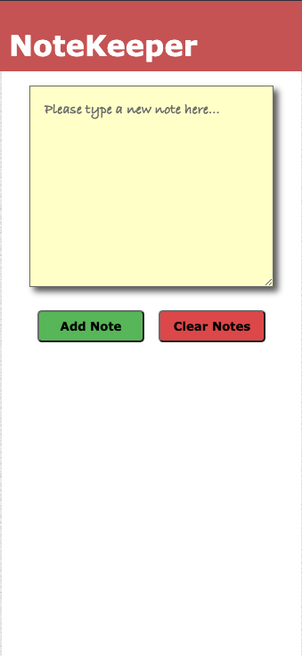
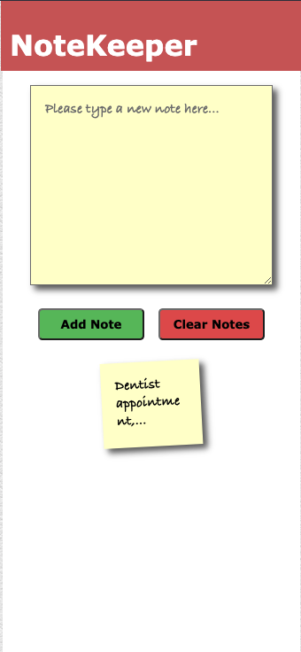
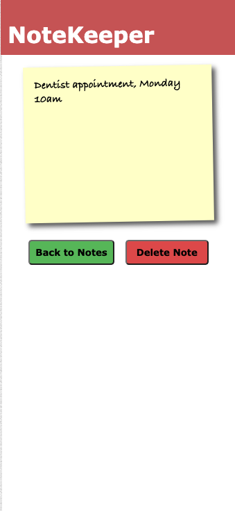
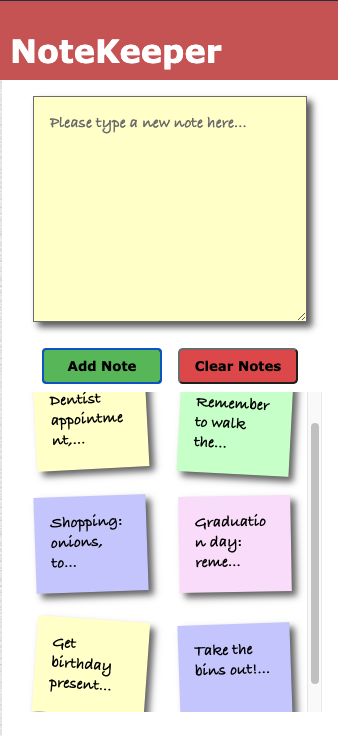

# Group project - Notes

Deployed to [GitHub Pages](https://iainaitken.github.io/notes-app/).

## Description

A single-page front-end vanilla JavaScript app for note taking.

### Project challenges

* To create a web app that only uses a single page.
* To do so without using any external libraries, such as jQuery or Jasmine.
* To develop the app in a TDD way, by creating our own test library in JavaScript.

### User stories

```
As a programmer
I can see a list of my notes, where each note is abbreviated to the first 20 characters
So I can find the one I want
```
```
As a programmer
I can create a new note
So I can record something I need to remember
```
```
As a programmer
I can see the full text of an individual note on its own page
So I can see all the information in the note
```
```
As a programmer
I can use shortcodes like `:fire:` that get converted into emojis like 🔥
So I can record notes with fun little pictures
```
```
As a programmer
I can delete notes once I no longer need them
So that I can stay organised
```

### Team Members

[Iain Aitken](https://github.com/iainaitken)

[Joey Hornsby](https://github.com/jshorns)

[Joanna Brigham](https://github.com/JLBrigham)

[Lee Jones](https://github.com/joneslee111)

## How to use

Navigate to https://iainaitken.github.io/notes-app/.

Type a new note, and then click on "Add Note".



To open a previously-saved note, simply click on the note. You can then either navigate back to the main page, or delete the note.





Use the scroll bar to the right to scroll through the list of notes.



To delete all notes, click on "clear notes".

### Tests

* The javascript folder is divided into src and spec folders. 
* To run the tests, open tests.html from the javascript folder in your browser. This loads and runs both the src and spec files.
* Open the console to view pass and fail messages for the tests.

## Diagrams


#### diagrams.codes code for this diagram:


```
alias u="User"
alias i="Interface/browser"
alias nb="Notebook"
alias n="Note"

u->i:"Navigate to page"
i->nb:"create new instance of notebook"
nb-->i:"return new instance of notebook"
i-->u:"Render index.html"
u->i:"enter note details + click submit"
i->n:"create new note instance"
n-->i:"return new note instance"
i->nb:"store new note in notebook"
nb->nb:"add note to array/hash"
nb->nb:"function to generate 20char descriptions"
nb-->i:"return 20char descriptions"
i->i:"update html file with descriptions"
i-->u:"render index.html"
```
